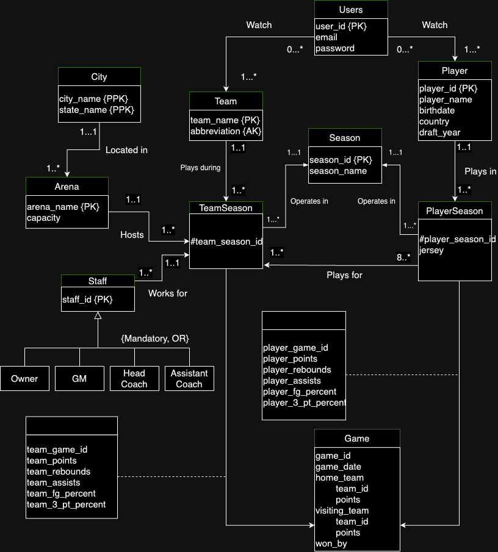

# Project Report
- **Project Name**: NBA Database.
- **Date**: 08.12.2023
- **Submitted by:**
Pranchal Shah, William Huang, Abhyuday Sureka
- **Class** : CS 5200 - Database Management Systems

## Overview

This NBA Database project is a comprehensive initiative aimed at gathering, organizing, and analyzing data related to the National Basketball Association (NBA). This project primarily focuses on the development of a robust database enriched with valuable information pertaining to NBA teams, players, seasons, and statistical data.

### Key Objectives
#### Data Collection and Management:
- Aggregate detailed information on NBA teams, players, and historical data.
- Implement efficient data management practices to ensure accuracy and reliability.

#### Frontend Website:
- Develop a user-friendly frontend website for easy interaction with the database.
- Provide a seamless interface for users to access and explore NBA-related insights.

#### User Flow:
- Establish a clear user flow, outlining commands and methods for user interaction.
- Enhance the user experience with intuitive navigation and data visualization.

## README.txt

1. Unzip the file.
2. There are two main components to this project: the frontend and the backend.
   - The frontend is a website that allows you to interact with the database.
   - The backend is express that calls mysql database to perform CRUD operations.
3. To run the application, you must have node.js installed on your computer.
   - To install node.js, please visit https://nodejs.org/en/download/.
   - run `npm install` in the frontend folder and the root folder.
   - cd into the frontend folder and run `npm start`.
   - cd into the root folder and run `node server/mainServer.js`.
4. This should open the website on your browser and start the backend server.
5. The backend server calls the mysql database to perform CRUD operations.
---

## Technical Specifications

**Languages Used:**
Javascript, mySQL, HTML, CSS, Python, JSON

**Applications used:**
MySQL Workbench, Visual Studio Code, GitHub

**Conceptual Design UML:**

---

## Logical Design of Database (Rev Engineer)
PDF version of the logical design of the database is [here](./logical_design_of_database_ShahPHuangWSurekaA.pdf).

Number of Tables: 18
Procedures : 17
CRUD Operations: 16

-------------------------
| Table Name | Number of Rows |
|------------|--------------|
| Player     |  4831  Persons   |
| Seasons       |  78  Seasons      |
| Teams       |  30 x 78 Seasons  |
| Owners       |  963 Owners  |
| Head Coaches       |  808 coaches  |
| Assistant Coaches       |  3302 coaches  |
| Games       |  63053 Games  |

---

## User Flow

1. Open the website.
2. Login to the website using the username and password that has your mySQL credentials. (If you do not have a mySQL account, please create one.)
3. Click on the "Teams" tab to view all the teams in the NBA.
   - Click on the "Team Roster" tab to view the roster of all the teams in the NBA.
     - Click on on any player to view their Headshot, Name, Position.
4. Click on the "Players" tab to view all the players in the NBA.
6. The website supports 16 CRUD operations.
   - Create
     - Create a new player.
     - Create a new team.
     - Create a new season.
     - Create a new game.
   - Read
     - Read all the players.
     - Read all the teams.
     - Read all the seasons.
     - Read all the games.
   - Update 
     - Update a player.
     - Update a team.
     - Update a game.
     - Update Arena
   - Delete
     - Delete a player.
     - Delete a team.
     - Delete a arena.
     - Delete a game.
7. There is a navigation bar on the top of the website that allows you to navigate to the different pages of the website. Specifically on the CRUD operations page, you can navigate to the different CRUD operations by clicking on the buttons on the navigation bar.
8. Each CRUD operation has a form that allows you to input the data that you want to create, update, or delete.
9. Once you have inputted the data, click on the "Submit" button to submit the data.
10. If you want to update or delete data, you must input the primary key of the data that you want to update or delete.
11. If you want to read data, you can click on the "Read" button to read the data.
12. If you want to go back to the home page, you can click on the "Home" button on the navigation bar.
13. If you want to go back to the CRUD operations page, you can click on the "CRUD Operations" button on the navigation bar.
---

## Lessons Learned

### Technical Expertise Gained

Throughout the course of this NBA Database project, our team gained valuable technical expertise in various domains:

- **Database Management:**
  - Acquired proficiency in designing and managing a complex relational database using MySQL.
  - Implemented best practices for data organization, indexing, and query optimization.

- **Frontend Development:**
  - Developed skills in creating a user-friendly frontend using HTML, CSS, React and JavaScript.
  - Explored techniques for enhancing user experience through intuitive navigation and data visualization.

- **Backend Development:**
  - Utilized Express for backend development, incorporating CRUD operations and ensuring data integrity.

- **Version Control and Collaboration:**
  - Leveraged Git and GitHub for version control, facilitating collaborative development and code management.
  - Gained insights into effective team collaboration, code reviews, and issue tracking.

### Insights

The project provided valuable insights into various aspects:

- **Time Management:**
  - Learned to balance tasks effectively to meet project milestones and deadlines.
  - Adapted to unforeseen challenges and adjusted project timelines accordingly.

- **Data Domain Understanding:**
  - Developed a deeper understanding of the NBA data domain, including player statistics, team dynamics, and historical trends.
  - Recognized the importance of accurate and consistent data for meaningful analysis.

- **Working with APIs:**
  - Gained experience in working with APIs, including data collection, parsing, and integration.
  - Explored techniques for handling inconsistent data and ensuring data integrity.

### Realized or Contemplated Alternative Design/Approaches

In the process of developing the NBA Database, we encountered scenarios that prompted consideration of alternative design approaches:

- **Data Collection Strategies:**
  - Explored different strategies for data collection, evaluating the trade-offs between real-time updates and data accuracy.
  - Considered alternative methods for handling inconsistent or "dirty" data from web sources.

- **Frontend Interface Design:**
  - Contemplated alternative designs for the frontend interface, balancing simplicity with the depth of information presented.
  - Explored different visualization techniques for presenting statistical insights.

### Code Issues

Despite our best efforts, we encountered a few challenges in the codebase:

- **Data Collection from API:**
  - Faced occasional issues with the stability of the API, necessitating careful verification of data changes.
  - Addressed challenges related to inconsistent data structure and unexpected variations.

## Future Work

### Planned Uses of the Database

In the future, the NBA Database is envisioned to be utilized for the following purposes:

- **Research and Analysis:**
  - Support academic research on player performance, team dynamics, and statistical trends.
  - Provide a valuable resource for analysts and sports enthusiasts studying the NBA.

- **Decision Support:**
  - Assist team managers and coaches in making informed decisions based on historical data and player statistics.
  - Serve as a tool for predicting team performance and strategizing for future seasons.

### Potential Areas for Added Functionality

To enhance the functionality and utility of the NBA Database, the following areas are identified for potential expansion:

- **Social Integration:**
  - Implement features for users to share insights and statistics on social media platforms.
  - Integrate social elements to foster community engagement and discussion.

- **Mobile Application:**
  - Develop a mobile application for convenient access to NBA insights on smartphones and tablets.
  - Ensure cross-platform compatibility to reach a broader user base.

### Seasonal Data for Roster

To keep the database relevant and dynamic, focus on the following enhancements:

- **Real-time Updates:**
  - Implement mechanisms for real-time updates to capture changes in team rosters during the season.
  - Explore APIs or data sources that provide timely information for immediate integration.

- **Scalability:**
  - Design the database to handle increased data volume during peak seasons.
  - Ensure efficient data retrieval and storage to accommodate the dynamic nature of the NBA.

- **Advanced Statistics:**
  - Explore and integrate advanced statistical metrics to provide a more nuanced analysis of player and team performance.
  - Incorporate machine learning algorithms for predictive analytics.

### Additional Functionality on the Front End

To enrich the user experience and provide more comprehensive insights, consider the following additions:

- **Playoff Predictions:**
  - Develop algorithms to predict teams most likely to qualify for the playoffs based on current and historical data.
  - Provide users with playoff scenarios and probabilities.

- **Awards Predictions:**
  - Integrate predictive models to identify players most likely to win MVP, Rookie of the Year, and other prestigious awards.
  - Showcase potential award candidates based on performance metrics.

- **Draft Predictions:**
  - Develop algorithms to predict which team is likely to have the first-round pick in the upcoming season.
  - Provide insights into potential draft prospects and their projected impact.

- **Player Performance Comparison:**
  - Implement algorithms to compare a player's current statistics to their previous performances in different time frames.
  - Allow users to visualize and analyze the evolution of a player's skills over their career.

